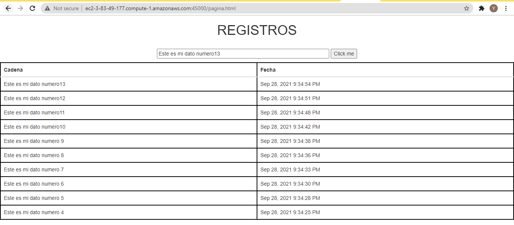

# lab4-dockerHubandAWS

## Introducción

En este laboratorio se realizo:

  1. Un micro-servicio(connectionDB) que se encarga de conectar a una base de datos mongo que se encuentra alojada en un contenedor Docker, además connectionDB se encuentra en diferentes puertos.
  2. Un micro-servicio(RouteRobin) que se encarga de enviar la peticion al servidor connectionDB, el RouteRobin tiene un balanceador de carga que disribuye las peticiones del cliente en los diferentes puertos del connectionDB.
  3. Un frontend se encuentra en RouteRobin con uri /pagina.html
  4. Estos micro-servicios se subieron a DockerHub
  5. Se desplego estos micro-servicios en contenedores Docker que se encuentra en una maquina virtual de EC2.

## Micro-servicio connectionDB

Este micro-servicio contiene 3 clases App, ConnectionDataBase y Tabla

* App: Es el controlador de la aplicación, y se encarga de las peticiones REST
* ConnectionDataBase: Es la encargada de hacer las peticiones a la base de datos 
* Tabla: Es el documento de la base de datos en este caso tiene de atributo "palabra" y "fecha"

## Micro-servicio RouteRobin

Este microservicio contiene 3 clases App, HttpConnection, RoundRobin

* App: Es el controlador de la aplicación, y se encarga de las peticiones REST.
* HttpConnection: Es la encargada de hacer las peticiones al micro-servicio connectionDB con la url que le hayan pasado.
* RoundRobin: Es la encargada de realizar la distribución de carga, por tanto aqui estan las diferentes urls que contienen a connectionDB y él elige la url que atendera la petición, en este caso se realizo un RoundRobin, que basicamente sigue el orden de una lista y cuando llegue al último de la lista vuelve a comenzar. En este caso connectionDB, estaba ejecutandose en el puerto 42000,42001,42002. por tanto, la primera petición se hizo por el puerto 42000, la segunda petición por la petición 42000, la tercera peticion por el purto 42002 y luego vuelve a empezar.

## frontend

Es el frontend de la aplicación que esta compuesta por un campo de texto, un botón y una tabla, al oprimir el botón envia lo que haya en la caja de texto y lo guarda en la base de datos, luego la tabla se actualiza y aparecen los diez últimos datos que se hayan ingresado en la base de datos.

## DockerHub

Cada micro-servicio tiene un archivo DockerFile que se encarga de construir la imagen para poderla subir al DockerHub, el micro-servicio "connectionDB" esta en el contenedor  julitom1/connectiondb y el micro-servicio "RouteRobin" esta en el contenedor julitom1/roundrobin.

## AWS

En AWS se creo una maquina virtual y se descargo Docker, Docker-Compose y se creo un archivo docker-compose.yml que descarga los contenedores de los repositorios de dockerHub, construye las respectivas imagenes y las pone a correr en los puertos indicados en el archivo.

Para finalizar desde AWS se abrieron los puertos para que cualquiera pueda entrar.

#### Contenedores ejecutandose

#### probando puerto 45000 obtener Datos

#### probando puerto 45000 enviar Datos

#### probando puerto 45000 frontend

## Diagrama de despliegue

## Autor

Yarit Yajanny Villalobos Jimenez

